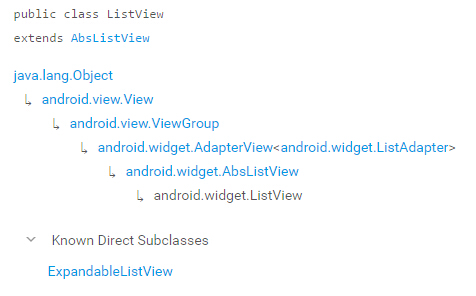

# ListView的基本属性与方法

ListView是一个用来纵向显示条目的视图,这些条目内容来自于与该ListView相关联的ListAdapter。

>官方文档较为全面
>https://developer.android.com/reference/android/widget/ListView.html

### ListView类的继承关系

XML 属性
+ android:divider//在列表条目之间显示的drawable或color。
+ android:dividerHeight//用来指定divider的高度。
+ android:entries//构成ListView的数组资源的引用。对于某些固定的资源，这个属性提供了比在程序中添加资源更加简便的方式。
+ android:footerDividersEnabled//当设为false时，ListView将不会在各个footer之间绘制divider.默认为true。
+ android:headerDividersEnabled//当设为false时，ListView将不会在各个header之间绘制divider.默认为true。

+ android:fadingEdge="vertical"//上边和下边有黑色的阴影值为none的话就没有阴影。
+ android:scrollbars="horizontal|none"//只有值为horizontal|vertical的时候，才会显示滚动条，并且会自动影藏和显示。
+ android:fastScrollEnabled="true" //快速滚动效果，配置这个属性，在快速滚动的时候旁边会出现一个小方块的快速滚动效果，自动隐藏和显示。
+ android:cacheColorHint// 表明这个列表的背景始终以单一、固定的颜色绘制，可以优化绘制过程。
+ android:choiceMode//为视图指定选择的行为。可选的类型有：none、singleChoice、multipleChoice、multipleChoiceModal。
+ android:drawSelectorOnTop// 若设为true，选择器将绘制在选中条目的上层。默认为false。
+ android:fastScrollEnabled// 设置是否允许使用快速滚动滑块。
+ android:listSelector// 设置选中项显示的可绘制对象，可以是图片或者颜色属性。
+ android:scrollingCache// 设置在滚动时是否使用绘制缓存。若设为true，则将使滚动表现更快速，但会占用更内存。默认为true。
+ android:smoothScrollbar//为真时，列表会使用更精确的基于条目在屏幕上的可见像素高度的计算方法。默认该属性为真，如果你的适配器需要绘制可变高的条目，他应该设为假。当该属性为真时，你在适配器在显示变高条目时，滚动条的把手会在滚动的过程中改变大小。当设为假时，列表只使用适配器中的条目数和屏幕上的可见条目来决定滚动条的属性。
+ android:stackFromBottom// 设置GridView和ListView是否将内容从底部开始显示。
+ android:textFilterEnabled// 当设为真时，列表会将结果过滤为用户类型。前提是这个列表的Adapter必须支持Filterable接口。
+ android:transcriptMode//设置列表的transcriptMode.有如下选项可选：
//(1)disabled       禁用TranscriptMode，也是默认值;
//(2)normal         当新条目添加进列表中并且已经准备好显示的时候，列表会自动滑动到底部以显示最新条目;
//(3)alwaysScroll   列表会自动滑动到底部，无论新条目是否已经准备好显示.

### ListView常用的方法

+ void addFooterView(View v)//增加一个固定在列表底部的View，参数v为欲添加的视图。
+ void addFooterView(View v,Object data,boolean isSelectable)//增加一个固定在列表底部的View，参数v为欲添加的视图,data为与View绑定的数据，isSelectable设置是否可选。
+ void addHeaderView(View v)//增加一个固定在列表顶部的View，参数 v为欲添加的视图
+ void addHeaderView(View v,Object data,boolean isSelectable)//增加一个固定在列表顶部的View，参数v为欲添加的视图,data为与View绑定的数据，isSelectable设置是否可选。
+ boolean removeFooterView(View v)//去除一个之前添加的FooterView,参数v为欲删除的视图，若成功删除则返回true。
+ boolean removeHeaderView(View v)//去除一个之前添加的HeaderView,参数v为欲删除的视图，若成功删除则返回true。

### ListView响应事件方法

+ boolean OnKeyDown(int keyCode,KeyEvent event)//当按下键时响应。
+ boolean OnKeyMultiple(int keyCode,int repeatCount,KeyEvent event)//重复按下键时响应，repeatCount为按下次数。
+ boolean OnKeyUp(int keyCode,KeyEvent event)//当键被释放时响应  。

### GET方法

+ ListAdapter getAdapter()//返回ListView正在使用的Adapter。
+ Drawable getDivider()//以Drawable形式返回divider。
+ int getDividerHeight()//设置divider的高度。
+ int getFooterViewCount()//返回FooterView的个数，若无返回0。
+ int getHeaderViewCount()//返回HeaderView的个数，若无返回0。
+ boolean getItemsCanFocus()//返回是否有可获得焦点的条目。
+ Drawable getOverscrollFooter()//返回绘制在所有条目之下的drawable。
+ Drawable getOverscrollHeader()//返回绘制在所有条目之上的drawable。

### SET方法

+ void setAdapter(ListAdapter adapter)//为ListView绑定Adapter。
+ void setCacheColorHint(int color)//参数为0时，将CacheColor设为透明；参数非零时，指定一种颜色作为ListView的背景。
+ void setDivider(Drawable divider)//为ListView中每个条目之间设定一个Divider  。
+ void setDividerHeight(int height)//设定Divider的高度，单位为pixel。
+ void setFooterDividerEnabled(boolean footDividerEnabled)//设置FooterView之间的Dividers是否可用。
+ void setHeaderDividerEnabled(boolean headDividerEnabled)//设置HeaderView之间的Dividers是否可用。
+ void setItemsCanFocus(boolean itemsCanFocus)//设置是否包含可获取焦点的Item。
+ void setOverscrollFooter(Drawable footer)//设置一个当滚动时或ListView未填满屏幕时能显示在ListView下方的Drawable。
+ void setOverscrollHeader(Drawable header)//设置一个当滚动时能显示在ListView上方的Drawable。
+ void setRemoteViewAdapter(Intent intent)//为此AbsListView设置一个通过intent连接到RemoteViewsService而提供的远程视图适配器。
+ void setSelection(int position)//设置被选中的条目。如果参数小于0，则position为0的条目将被选中。
+ void setSelectionAfterHeaderView()//选中headerView下方的第一条条目。

### 官方API截图

